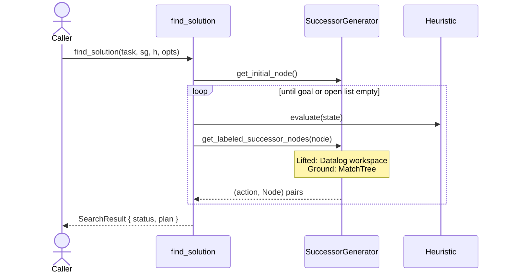
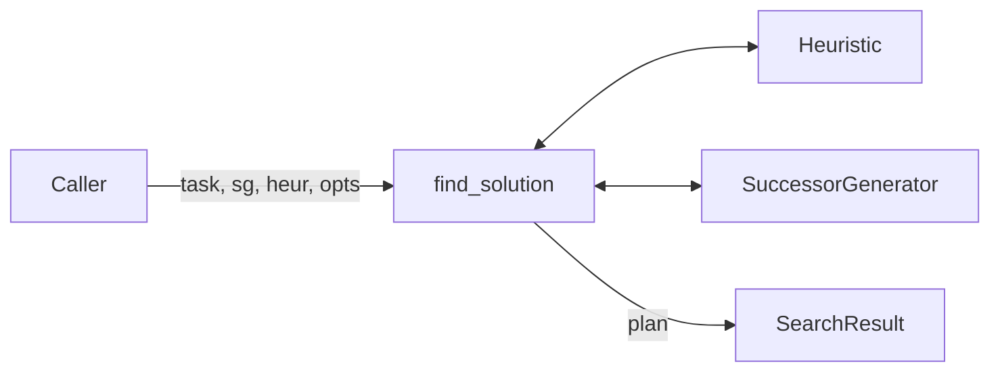
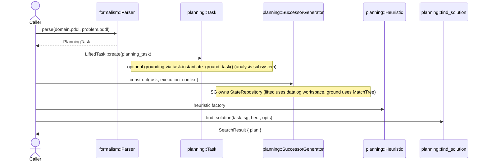
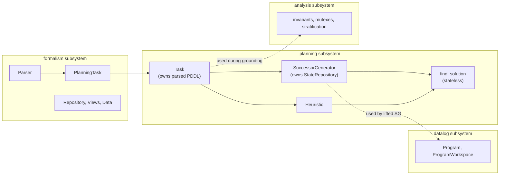

# Diagram options — working doc

Side-by-side of the current sequence diagrams in [search](search.md) and [architecture](architecture.md) versus proposed flowchart alternatives. Pick one of each; I'll swap in your choice and delete this file.

---

## search.md

### Option A — current (sequenceDiagram)

What this conveys: push-style API (caller waits while loop runs), `SuccessorGenerator` and `Heuristic` as peers, lifted/ground polymorphism anchored at the SG boundary via the `Note over`.

### Option B — proposed (flowchart)

What this conveys: `find_solution` is a process that exchanges information with two plug-ins (`Heuristic`, `SuccessorGenerator`) and produces a result. The peer-plug-point structure is visually direct.

**What's lost going from A to B**: the time axis. The sequence diagram makes "Caller is blocked until SearchResult returns" visually obvious because Caller goes off-screen during the loop; the flowchart can't render that as vividly. The lifted/ground polymorphism note has no natural anchor in B — it would move into prose.

---

## architecture.md

### Option A — current (sequenceDiagram)

What this conveys: the temporal trace through `exe/astar_eager.cpp`. Caller drives the pipeline; each subsystem is constructed in order; ownership notes attached to Task and SG.

### Option B — proposed (component diagram)

Note: in Mermaid this uses `flowchart` syntax, but the *semantic* shape is a component diagram — subsystems as subgraphs, internal types as nodes, ownership as inline annotations, cross-subsystem dependencies as labelled dashed arrows. Different from a pure flowchart in that the arrows mean "depends on" or "is consumed by," not "data flows next."

What this conveys: subsystem boundaries explicit (the subgraphs), major types per subsystem visible, ownership inlined on the boxes that own things, in-pipeline arrows separate from cross-subsystem-dependency arrows (dotted with conditions). Reads as "here's the topology of Tyr" rather than "here's one call trace."

**What's lost going from A to B**: the Caller actor disappears, so "who drives this" is implicit. The `exe/astar_eager.cpp` framing has to move into prose. But the docs around the diagram (the existing How-it-works prose) already do that, so the loss is minimal.

---

## My read, for what it's worth

- **architecture.md**: swap to the component diagram. It's what an architecture doc is actually for — static topology, subsystem boundaries, dependency relationships, ownership facts — not a temporal trace.
- **search.md**: closer call. The sequence diagram does specific work (push-style visibility, polymorphism anchor) that the flowchart loses. But the flowchart is more conventional in this field, and if you find sequence diagrams jarring then so will every other planning researcher who reads the doc. Probably swap, but I wouldn't push back on either choice.

After you decide, I'll implement the chosen diagram and remove this file.
