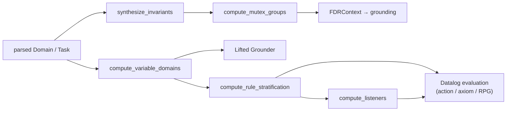

# `analysis`

*A family of preprocessing computations consumed during task grounding and Datalog evaluation: variable domains, rule stratification, listeners, invariant synthesis, mutex groups. Physically split between two directories — see [How it works](#how-it-works).*

## Purpose

Analysis is preprocessing work that has to happen between "we have a parsed PDDL task" and "we can run search on it." It is not on the critical path for a *pre-built* ground task — once `Task<GroundTag>` exists, search runs without consulting analysis. Where it earns its keep is in lifted→ground grounding (mutex-group-driven FDR discretisation) and in setting up the Datalog evaluator (stratification, listeners, variable domains). Conceptually a single subsystem, but the code is physically split: `include/tyr/analysis/` holds the lifted-level computations (variable domains, stratification, listeners), while invariant synthesis and mutex groups live under `include/tyr/formalism/planning/invariants/`. The physical split tracks history more than conceptual boundary; treat it as one subsystem when reasoning.

### How it works

The pipeline runs once per task and feeds two distinct downstream consumers. Grounding (`Task<LiftedTag>::instantiate_ground_task()`) takes the invariants and mutex groups to discretise fluents into FDR variables. Datalog setup (in action / axiom / RPG programs) takes variable domains, rule stratification, and listeners to determine evaluation order and dependency tracking.

Invariant synthesis is Helmert-style iterative deepening: start with singleton-fact predicates as candidates, expand by intersection, check each candidate by forward proof (add effects must balance removes), and split unproven candidates by the threatening atom. Stratification is a topological sort over the SCCs of the rule-dependency graph (Boost Graph Library). Listener computation produces the inverse index — for each fluent predicate, which rules need to re-fire when it changes — organised by stratum so Datalog only re-evaluates within the current stratum.

## API

- `synthesize_invariants(DomainView)` — [include/tyr/formalism/planning/invariants/synthesis.hpp:27](../../include/tyr/formalism/planning/invariants/synthesis.hpp#L27). Returns a set of state invariants. Exposed to Python under [pytyr.formalism.planning.invariants](../../python/src/pytyr/formalism/planning/invariants.cpp).
- `compute_mutex_groups(initial_atoms, fluent_atoms, invariants)` — [include/tyr/formalism/planning/invariants/mutexes.hpp](../../include/tyr/formalism/planning/invariants/mutexes.hpp). Derives FDR-ready mutex groups from invariants.
- `compute_variable_domains(TaskView | ProgramView)` — [include/tyr/analysis/domains.hpp](../../include/tyr/analysis/domains.hpp). Consumed by the lifted grounder and by the Datalog programs (action, axiom, RPG).
- `compute_rule_stratification(Program)` — [include/tyr/analysis/stratification.hpp](../../include/tyr/analysis/stratification.hpp). Topological-sort SCCs of the rule-dependency graph. Used only inside Datalog program construction.
- `compute_listeners(Program, stratification)` — [include/tyr/analysis/listeners.hpp](../../include/tyr/analysis/listeners.hpp). Per-fluent-predicate inverse index; used by the Datalog evaluator for dependency-driven re-firing.
- **Consumers**:
  - Grounding: [src/planning/lifted_task/task_grounder.cpp](../../src/planning/lifted_task/task_grounder.cpp) around line 508 calls `synthesize_invariants` then `compute_mutex_groups` then builds an `FDRContext`. Conditional — skipped if the task has no fluent actions.
  - Datalog program construction: `src/planning/programs/action.cpp`, `axiom.cpp`, `rpg.cpp`. These are the only callers of stratification and listeners.
  - Analysis is **not** called during heuristic precomputation, search, or anywhere outside grounding-time work.

## Non-obvious things

- **Stratification is enforced at runtime, not at task validation.** If the rule-dependency graph contains a non-stratifiable cycle (a negative loop through axioms), `compute_rule_stratification` raises `std::runtime_error` from [src/analysis/stratification_utils.hpp](../../include/tyr/analysis/stratification.hpp) during grounding. There is no fallback, no relaxation, no pre-flight check that warns earlier in the pipeline — a domain that turns out to be non-stratifiable simply fails to ground. PDDL files that parse and produce a valid lifted `Task<LiftedTag>` can still fail at `instantiate_ground_task()` for this reason. Practical consequence: a domain author who writes axioms with subtle negative dependencies discovers the problem only when someone tries to ground.

## Pointers

- Read first: [include/tyr/formalism/planning/invariants/synthesis.hpp](../../include/tyr/formalism/planning/invariants/synthesis.hpp) — the most self-contained and the one piece of analysis that's exercised by direct unit tests ([tests/unit/formalism/planning/invariants/synthesis.cpp](../../tests/unit/formalism/planning/invariants/synthesis.cpp)).
- Then: [src/planning/lifted_task/task_grounder.cpp](../../src/planning/lifted_task/task_grounder.cpp) around line 508 — see how invariants + mutex groups feed FDR construction.
- For the Datalog-side analysis: [include/tyr/analysis/stratification.hpp](../../include/tyr/analysis/stratification.hpp) and [include/tyr/analysis/listeners.hpp](../../include/tyr/analysis/listeners.hpp) together — read both; they're symbiotic.
- For domain analysis: [include/tyr/analysis/domains.hpp](../../include/tyr/analysis/domains.hpp).
- **Test coverage gap**: only `synthesize_invariants` has direct unit tests. Domains, stratification, and listeners are exercised only transitively via grounding tests. Worth noting if you're modifying any of them.
- Related design docs: [formalism](formalism.md), [datalog](datalog.md) (primary consumer of stratification + listeners), [successor-generation](successor-generation.md) (grounding sits behind the ground SG), [architecture](architecture.md).

---

*Last reviewed: 2026-05-23 against commit `01d444d2`. Audit drift with `make docs-audit DOC=analysis` (planned).*
