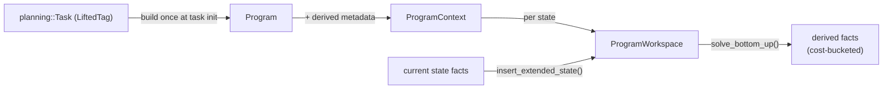

# `datalog`

*Tyr's custom parallel semi-naive Datalog engine. Built once per task as a `Program`, executed per state via a `ProgramWorkspace`. Consumed only by [planning](search.md) — there is no external Datalog API.*

## Purpose

Datalog is the engine that powers Tyr's lifted machinery: it computes which actions are applicable at a state, evaluates axioms, and drives RPG-style reachability. It is *not* a general-purpose library — there is no CLI, no public Datalog programming model, and it's deliberately not surfaced through the Python bindings. The engine is structured in two layers: a **formalism layer** holds immutable program structure (rules and atoms over [formalism](formalism.md) types), and an **evaluation layer** holds mutable state and the parallel semi-naive loop. The split lets a Program be compiled once per task and queried many times — typically once per search state — with workspace allocations cleared and reused rather than rebuilt.

### How it works

Lifecycle layers:

`Program` is the immutable rule set built at task initialisation: each PDDL action schema becomes a Datalog rule whose head is the action's *applicability predicate* and whose body is its preconditions. `ProgramContext` wraps this with derived metadata — variable domains, rule stratification, listener hooks (which rules depend on which fluent predicates). `ProgramWorkspace` is the mutable execution state allocated per query: facts, intermediate derivations, and **cost buckets** that partition facts by derivation depth.

The evaluation loop in [src/datalog/bottom_up.cpp](../../src/datalog/bottom_up.cpp) is cost-bucket-driven rather than iteration-to-fixpoint:

1. Pull next non-empty cost bucket; activate rules whose preconditions just appeared.
2. `tbb::parallel_for_each` over active rules — each rule runs in its own task, with thread-local `Worker` state via `enumerable_thread_specific`.
3. Each rule worker enumerates new k-cliques via **Delta-KPKC**: only cliques involving at least one *newly added* fact. Optional inner parallelism (`TYR_ENABLE_INNER_PARALLELISM`) further parallelises across delta edges.
4. Sequentially merge worker results back into the program; insert new heads into the appropriate cost bucket.
5. Advance to the next bucket. Repeat until no more facts derive.

Parallelism scope is **across rules within a stratum**, not across states; strata themselves execute sequentially. See [Non-obvious things](#non-obvious-things) for why this matters.

## API

- `solve_bottom_up(ProgramExecutionContext&)` — [src/datalog/bottom_up.cpp:470](../../src/datalog/bottom_up.cpp#L470). The single entry point consumers call.
- `Program` — [include/tyr/formalism/datalog/program_data.hpp](../../include/tyr/formalism/datalog/program_data.hpp). Immutable rule/atom container; built via the formalism `Repository` mechanism, so atoms share `Data<T>` storage with the rest of the task.
- `Rule` — [include/tyr/formalism/datalog/rule_data.hpp](../../include/tyr/formalism/datalog/rule_data.hpp). Head, body (a conjunctive condition), cost.
- `ProgramContext` — [include/tyr/datalog/program_context.hpp:30](../../include/tyr/datalog/program_context.hpp#L30). Program + repository + factory + variable domains + rule strata + listener hooks.
- `ProgramWorkspace<OrAP, AndAP, TP>` — [include/tyr/datalog/workspaces/program.hpp:123](../../include/tyr/datalog/workspaces/program.hpp#L123). Per-state mutable: facts, active rules, cost buckets, annotation policies. Cleared and reused across queries, not reallocated.
- `RuleWorkspace<AndAP>` — [include/tyr/datalog/workspaces/rule.hpp:158](../../include/tyr/datalog/workspaces/rule.hpp#L158). Per-rule state; holds the KPKC graph and thread-local workers.
- **Consumers** (the *only* consumers — Datalog has no external API):
  - Lifted successor generation: [src/planning/lifted_task/successor_generator.cpp](../../src/planning/lifted_task/successor_generator.cpp) — applicable-action discovery.
  - Axiom evaluation: `src/planning/.../axiom_evaluator.cpp`.
  - Task grounding / RPG: `src/planning/.../task_grounder.cpp`, `src/planning/.../rpg.cpp`.

## Non-obvious things

- **Cost buckets give Tyr's Datalog best-first-like iteration without explicit cost annotations on rules.** Most semi-naive engines either run to fixpoint (every derivation) or are stratified (one stratum at a time). Tyr's evaluator partitions facts by derivation depth at runtime — bucket 0 holds ground facts, bucket 1 holds one-hop derivations, etc. — and the loop pulls buckets in order. The payoff is that lower-cost answers stream out first: a heuristic that wants "applicable actions reachable within k steps" can stop the iteration when bucket k+1 starts. This is what makes Datalog usable for RPG-style heuristics where exhaustive evaluation would dominate. See [include/tyr/datalog/workspaces/program.hpp](../../include/tyr/datalog/workspaces/program.hpp) for the bucket abstraction.
- **Parallelism is scoped to rules within a single query, not across queries.** The intuition "each search state is independent, so parallelise across states" is wrong here — search calls `solve_bottom_up` serially, once per expansion, and the workspace is single-threaded across calls. TBB parallelism instead lives *inside* one call: many rules evaluate concurrently against the same workspace, and optionally Delta-KPKC parallelises across edges within a rule. The build flag is `TYR_ENABLE_INNER_PARALLELISM` (default OFF; see [CLAUDE.md](../../CLAUDE.md)).

## Pointers

- Read first: [include/tyr/datalog/program_context.hpp](../../include/tyr/datalog/program_context.hpp) — the wrapper that ties Program to its derived metadata. Smallest meaningful entry.
- Then: [include/tyr/datalog/workspaces/program.hpp](../../include/tyr/datalog/workspaces/program.hpp) — the mutable per-state state, including the cost-bucket structure.
- Then: [src/datalog/bottom_up.cpp](../../src/datalog/bottom_up.cpp) — the actual evaluation loop. Lines 331–466 are the main loop; line 470 is the entry point.
- For the formalism / evaluation split: contrast [include/tyr/formalism/datalog/](../../include/tyr/formalism/datalog/) (immutable) with [include/tyr/datalog/](../../include/tyr/datalog/) (mutable).
- Consumer example: [src/planning/lifted_task/successor_generator.cpp:93](../../src/planning/lifted_task/successor_generator.cpp#L93) — where the lifted SG repopulates a workspace for one state.
- Related design docs: [successor-generation](successor-generation.md) (primary consumer), [formalism](formalism.md) (atoms/rules are formalism types), [analysis](analysis.md) (which computes stratification and listeners), [architecture](architecture.md).

---

*Last reviewed: 2026-05-23 against commit `01d444d2`. Audit drift with `make docs-audit DOC=datalog` (planned).*
