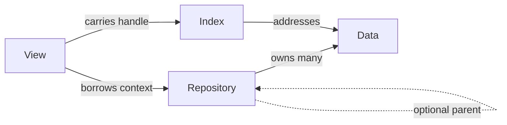

# `formalism`

*Tyr's PDDL representation: a Repository / View / Data pattern that every other subsystem cross-references. Parsing flows from PDDL text through Loki into tyr Repository entries; downstream code never touches Loki types directly.*

## Purpose

The formalism subsystem owns the type system for PDDL planning. Every entity — `Object`, `Predicate`, `Atom`, `Literal`, `Action`, `Function`, etc. — is represented by three coordinated pieces: a `Data<T>` immutable payload, a tightly-packed `Index<T>` that addresses it, and a `View<Index<T>, Repository>` that pairs the index with a borrowed Repository pointer to give read access. The Repository owns the `Data<T>` pools, supports optional parent chains for lexical scoping (action parameters, `forall` effects), and dispenses Views on demand. Parsing is a separate concern: a `loki::Parser` produces an AST, a `LokiToTyrTranslator` converts AST nodes into `Data<T>` via the Repository's `get_or_create` machinery, and the result is a [`PlanningTask`](#api) ready for planning.

### How it works

The Repository / View / Data triple is the entire conceptual pattern; the rest of formalism is variations on it. The pattern repeats verbatim for every PDDL entity — `ObjectData / ObjectIndex / ObjectView`, `PredicateData / …`, `ActionData / …`, and so on:

`Data<T>` payloads are immutable and laid out for `cista::offset` zero-copy serialisation (e.g., `ObjectData` is `{ Index<Object>, cista::offset::string name }`). Views are cheap — they hold a Repository pointer and a small Index — and dereference lazily via `get_data()`. Repositories expose `find`, `get_or_create`, and `operator[]`; when a Repository has a parent, those lookups walk the chain upward. See [API](#api) for the concrete types.

The parsing pipeline is linear:

> `parser.parse_task(problem.pddl)` → `loki::Parser` builds the Loki AST → `LokiToTyrTranslator::translate()` walks the AST and populates a tyr Repository via `get_or_create` → returns a `PlanningTask` that owns the Repository and a top-level `TaskView`.

Domain and problem are merged into a single `PlanningTask` — there is no separate `Domain` or `Problem` entity surfaced to planning.

## API

- `formalism::planning::Parser` — [include/tyr/formalism/planning/parser.hpp](../../include/tyr/formalism/planning/parser.hpp). Constructor takes a domain PDDL file; `parse_task(problem)` returns a `PlanningTask`.
- `formalism::planning::PlanningTask` — [include/tyr/formalism/planning/planning_task.hpp](../../include/tyr/formalism/planning/planning_task.hpp). Owns the Repository, the parsed `TaskView`, and an FDR context. This is the top-level container handed to [planning](search.md#api).
- **Views** (the read API for entities): `ObjectView`, `PredicateView`, `ActionView`, `AtomView`, `LiteralView`, `FunctionView`, and friends. Each lives next to its `Data<T>` and `Index<T>` under [include/tyr/formalism/](../../include/tyr/formalism/). The pattern is consistent — reading `object_view.hpp` once generalises.
- **Repository** — [include/tyr/formalism/repository.hpp](../../include/tyr/formalism/repository.hpp). Templated over a `SymbolRepository` (objects, predicates, …) and a `RelationRepository` (atoms, literals, …).
- **Internal / not in the consumer API**: `LokiToTyrTranslator`, `RepositoryFactory`, `Builder` types, `Formatter` (pretty-printing). Used during parsing and debugging; planning never calls these directly.
- **Consumers**: every other subsystem. [planning](search.md), [datalog](datalog.md), [analysis](analysis.md) all hold Views into a Repository owned by a `PlanningTask`.

## Non-obvious things

- **An `Index<T>` is meaningless without its Repository context.** A bare `Index<Object>` is just an integer; dereferencing requires the Repository (or one in the same parent chain) that allocated it. This is why downstream code always holds a Repository pointer alongside indices, or works exclusively through Views — Views carry the context themselves. When a Repository has a parent, `operator` walks the parent chain (see [src/formalism/repository.hpp](../../include/tyr/formalism/repository.hpp)) — O(depth) rather than O(1) — but depth is typically 2–3 (root domain → action scope → quantifier scope) so the cost is bounded.
- **`Data<T>` is Cista-serialisable in place.** Strings are `cista::offset::string`; there are no raw pointers in `Data<T>` payloads. Consequence: a `Data<T>` can be memory-mapped, sent across a buffer, or memcpy'd without fix-up. This is what makes Views genuinely zero-copy — `get_data()` returns a `const Data<T>&` pointing into the Repository's pool with no decoding step. See [include/tyr/formalism/object_data.hpp](../../include/tyr/formalism/object_data.hpp) for the canonical layout. The same constraint is what shapes [datalog](datalog.md)'s and [planning](search.md)'s buffer-friendly state representations downstream.

## Pointers

- Read first as the canonical exemplar of the pattern: [object_data.hpp](../../include/tyr/formalism/object_data.hpp), [object_index.hpp](../../include/tyr/formalism/object_index.hpp), [object_view.hpp](../../include/tyr/formalism/object_view.hpp). Three small files together; you've internalised the whole pattern after reading them.
- Then: [repository.hpp](../../include/tyr/formalism/repository.hpp) for parent-chain semantics and the lookup methods.
- Parser flow: [parser.hpp](../../include/tyr/formalism/planning/parser.hpp) → [src/formalism/planning/loki_to_tyr.cpp](../../src/formalism/planning/loki_to_tyr.cpp) → [planning_task.hpp](../../include/tyr/formalism/planning/planning_task.hpp).
- Related design docs: [architecture](architecture.md), [search](search.md), [successor-generation](successor-generation.md).

---

*Last reviewed: 2026-05-22 against commit `01d444d2`. Audit drift with `make docs-audit DOC=formalism` (planned).*
