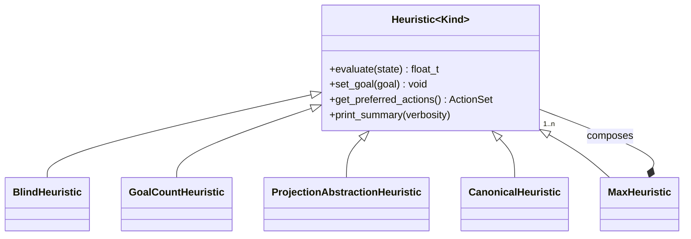

# `heuristics`

*The plug point that lets search algorithms order their open list. `Heuristic<Kind>` is a small virtual interface; concrete heuristics range from trivial (`BlindHeuristic` returns 0) to nontrivial (`ProjectionAbstractionHeuristic` precomputes a Dijkstra over an abstract state space).*

## Purpose

Heuristics provide cost-to-go estimates that [search](search.md) consults during expansion. The subsystem is shaped as a small abstract base — one pure-virtual method — with a family of concrete heuristics layered on top. Unlike `SuccessorGenerator<Kind>`, which uses a C++20 concept to enforce its contract at compile time (see [successor-generation](successor-generation.md)), heuristics are genuinely OO-polymorphic: the search algorithm holds a `shared_ptr<Heuristic<Kind>>` and calls `evaluate` virtually. This is the one place in the planning subsystem where runtime dispatch is the right tool — heuristics are often composed and swapped, and the virtual call cost is dwarfed by the heuristic's own work.

### How it works

Concrete heuristics are constructed via a static factory `::create(...)` returning `shared_ptr<Heuristic<Kind>>`, never directly with `new`. The factory has two jobs: (1) defer construction so the caller can store and pass `shared_ptr`s polymorphically without worrying about lifetime; (2) do any heavy precomputation (Dijkstra over an abstraction, RPG construction, projection pattern selection) at heuristic-creation time, not on the first `evaluate` call. The constructor itself is typically light; the factory is where the work happens. Once built, `evaluate(state)` is hot-path code called once per search-node expansion.

The `Kind` template parameter constrains heuristics to operate on `StateView<Kind>`. Most heuristics — `BlindHeuristic`, `GoalCountHeuristic`, `MaxHeuristic` — are uniform in `Kind` and work identically for lifted and ground tasks. Heuristics that need to materialise a state space (`ProjectionAbstractionHeuristic`, `CanonicalHeuristic`) are explicitly instantiated for both `LiftedTag` and `GroundTag` (see [Non-obvious things](#non-obvious-things)).

## API

- `Heuristic<Kind>` — [include/tyr/planning/heuristic.hpp](../../include/tyr/planning/heuristic.hpp). Pure-virtual `evaluate(StateView<Kind>&) → float_t`. Other methods are virtual with sensible defaults: `set_goal` is a no-op, `get_preferred_actions` returns empty, `print_summary` is a stub. A new heuristic only has to override `evaluate`.
- **Concrete heuristics**, all under [include/tyr/planning/heuristics/](../../include/tyr/planning/heuristics/):
  - `BlindHeuristic<Kind>` — always returns 0. Useful for uniform-cost search and as a sanity baseline.
  - `GoalCountHeuristic<Kind>` — number of unsatisfied goal conjuncts (atoms, negations, numeric constraints).
  - `ProjectionAbstractionHeuristic<Kind>` — shortest-path distance in an abstract state space defined by a *projection pattern* (subset of facts); computed by backward Dijkstra at `create()` time.
  - `CanonicalHeuristic<Kind>` — maximum over additive partitions of multiple projections; partitions found via maximal-clique enumeration on a non-overlap graph.
  - `MaxHeuristic<Kind>` — composes a set of sub-heuristics and returns the max.
  - `AddRPGHeuristic`, `MaxRPGHeuristic`, `FFRPGHeuristic` — **declarations only** in [include/tyr/planning/heuristics/](../../include/tyr/planning/heuristics/); implementation pending.
- **Factory pattern**: every concrete heuristic exposes a static `::create(...)` returning `shared_ptr<Heuristic<Kind>>`. Example signatures vary — `BlindHeuristic<Kind>::create()` takes nothing, `GoalCountHeuristic<Kind>::create(task)` takes the task, `ProjectionAbstractionHeuristic<Kind>::create(task, pattern)` takes both.
- **Consumers**: [search](search.md) algorithms hold a `shared_ptr<Heuristic<Kind>>` and call `evaluate` per expansion. Heuristics that compose (e.g., `MaxHeuristic`) hold their own `shared_ptr`s to children.

## Non-obvious things

- **Every `Kind`-parameterised heuristic must explicitly instantiate at the bottom of its `.cpp`** for both `LiftedTag` and `GroundTag` (e.g., `template class GoalCountHeuristic<LiftedTag>; template class GoalCountHeuristic<GroundTag>;`). Without these lines the linker fails to find the method definitions when search is instantiated for a particular `Kind`. This is a consequence of putting implementations in `.cpp` files rather than headers; the alternative (header-only heuristics) would shift compile-time cost rather than eliminate it. New heuristic authors hit this immediately and the failure mode (link error, not compile error) is unintuitive.
- **Heavy precomputation lives in `::create()`, not the constructor.** A `ProjectionAbstractionHeuristic` runs a Dijkstra at creation time; an RPG-based heuristic builds a relaxed planning graph. This is invisible from the abstract interface — `Heuristic<Kind>` says nothing about when precomputation happens — but it's a real architectural commitment: heuristic objects are *expensive to build* and *cheap to query*, by convention. A reader who tries to construct a heuristic inside the search loop will see surprising performance.

## Pointers

- Read first: [include/tyr/planning/heuristic.hpp](../../include/tyr/planning/heuristic.hpp) — the interface in 30 lines.
- Then: [include/tyr/planning/heuristics/blind.hpp](../../include/tyr/planning/heuristics/blind.hpp) and its `.cpp` — the smallest end-to-end example, factory included.
- Then: [include/tyr/planning/heuristics/goal_count.hpp](../../include/tyr/planning/heuristics/goal_count.hpp) — a real heuristic with state inspection.
- For the precomputation-in-factory pattern: [src/planning/heuristics/projection_abstraction.cpp](../../src/planning/heuristics/projection_abstraction.cpp).
- **Active in-progress code**: the `ProjectionAbstractionHeuristic` has eight failing sub-tests at [tests/unit/planning/heuristics/projection_abstraction.cpp](../../tests/unit/planning/heuristics/projection_abstraction.cpp) — evaluates return 0/1 where fixture expects non-zero. Likely site of the bug is in `evaluate()` or the Dijkstra construction in `create()`. This is the correctness-fix demo target for the lab-meeting talk; see [dev-loop-plan.md](../../dev-loop-plan.md).
- Related design docs: [search](search.md), [successor-generation](successor-generation.md), [formalism](formalism.md), [architecture](architecture.md).

---

*Last reviewed: 2026-05-23 against commit `01d444d2`. Audit drift with `make docs-audit DOC=heuristics` (planned).*
