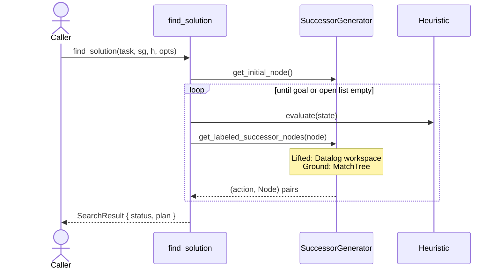

# `search`

*Tyr's planning algorithms: turn a `Task<Kind>` into a `Plan`, parameterised over the lifted/ground split.*

## Purpose

The search subsystem owns the outer planning loop — open list, closed list, goal test, plan extraction — and explicitly *not* successor generation or heuristic evaluation, which plug in via `SuccessorGenerator<Kind>` and `Heuristic<Kind>`. The same loop runs against lifted and grounded tasks; the difference is hidden behind the `Kind` template parameter.

### How it works

Every algorithm exposes a single push-style entry point — a free function `find_solution<Kind>(task, succ_gen, heuristic, options)` returning `SearchResult<Kind>`; see [API](#api) for the concrete entries. There is no abstract `Search` base class, no incremental `expand_next()` API — the caller hands over everything and receives a result back. A* and GBFS each implement their own outer loop and keep their own private `SearchNode` records (g-value, parent, open/closed status — see [src/planning/algorithms/astar_eager.cpp:58](../../src/planning/algorithms/astar_eager.cpp#L58)); the public `Node<Kind>` is a lightweight view used only for cross-boundary communication.

Lifted and grounded share this loop verbatim — the only difference is which `SuccessorGenerator<Kind>` is instantiated. See [successor-generation](successor-generation.md) for that split.

## API

- `astar_eager::find_solution<Kind>(...)` — [include/tyr/planning/algorithms/astar_eager.hpp:48](../../include/tyr/planning/algorithms/astar_eager.hpp#L48). Eager A* with g + h ordering.
- `gbfs_lazy::find_solution<Kind>(...)` — [include/tyr/planning/algorithms/gbfs_lazy.hpp:48](../../include/tyr/planning/algorithms/gbfs_lazy.hpp#L48). Lazy GBFS, deferred heuristic evaluation.
- `Node<Kind>` — [include/tyr/planning/node.hpp](../../include/tyr/planning/node.hpp). `StateView<Kind>` plus a `float_t metric` field. The metric is the caller-visible cost; algorithm-internal state (g-value, parent pointer) lives in a private `SearchNode`.
- `SearchResult<Kind>` — [include/tyr/planning/algorithms/utils.hpp:42](../../include/tyr/planning/algorithms/utils.hpp#L42). Status enum + optional plan + optional goal node.
- `Heuristic<Kind>` — [include/tyr/planning/heuristic.hpp:35](../../include/tyr/planning/heuristic.hpp#L35). Pure virtual; one core method `evaluate(state) → float_t`. See [heuristics](heuristics.md).
- **Python**: `pytyr.planning.{lifted,ground}.{astar_eager,gbfs_lazy}.find_solution()` — bound as free functions in [python/src/pytyr/planning/bindings.cpp](../../python/src/pytyr/planning/bindings.cpp).
- **Consumers**: [exe/astar_eager.cpp](../../exe/astar_eager.cpp), [exe/gbfs_lazy.cpp](../../exe/gbfs_lazy.cpp) (reference planners). User code via the Python bindings or directly in C++.

## Non-obvious things

- **`Node<Kind>::metric` is interpreted polymorphically by the algorithm.** In A* it's the g-value; in GBFS the field exists but is ignored — queue ordering uses only h. Same `Node` constructor, different meaning. The payoff is a fixed-size, algorithm-agnostic Node; the cost is that "what does metric mean here" is a property of which algorithm you are inside.
- **The public `Node<Kind>` is not the algorithm's actual search record.** Each algorithm keeps its own internal `SearchNode` ([src/planning/algorithms/astar_eager.cpp:58](../../src/planning/algorithms/astar_eager.cpp#L58)) with g-value, parent, and open/closed bits. Public `Node<Kind>` instances are reconstructed during plan extraction from those internal records ([include/tyr/planning/search_space.hpp:49](../../include/tyr/planning/search_space.hpp#L49)). This keeps memory-per-state constant and lets new algorithms attach private metadata without breaking the public Node interface.

## Pointers

- Read first: [include/tyr/planning/algorithms/astar_eager.hpp](../../include/tyr/planning/algorithms/astar_eager.hpp) — smallest end-to-end entry point.
- Then: [include/tyr/planning/node.hpp](../../include/tyr/planning/node.hpp) and [include/tyr/planning/heuristic.hpp](../../include/tyr/planning/heuristic.hpp) for the data and plug-in types.
- Implementation: [src/planning/algorithms/astar_eager.cpp](../../src/planning/algorithms/astar_eager.cpp).
- Reference planner: [exe/astar_eager.cpp](../../exe/astar_eager.cpp) — what a real caller looks like.
- Related design docs: [successor-generation](successor-generation.md), [heuristics](heuristics.md), [formalism](formalism.md), [architecture](architecture.md).

---

*Last reviewed: 2026-05-22 against commit `01d444d2`. Audit drift with `make docs-audit DOC=search` (planned).*
