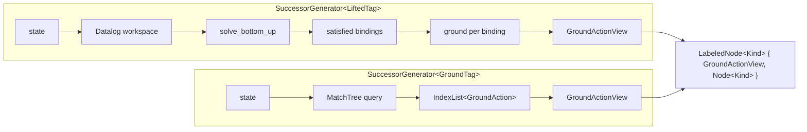

# `successor-generation`

*Where the lifted/ground split actually lives. `SuccessorGenerator<Kind>` turns "I'm at state X" into "(action, successor state) pairs"; lifted does it via on-the-fly Datalog grounding, ground does it via a precompiled MatchTree.*

## Purpose

`SuccessorGenerator<Kind>` is the only subsystem where lifted and ground planning genuinely diverge. Every other consumer of `Kind` (search, heuristics, state representation) gets templated specialisations that share an outer shape; the SuccessorGenerator gets two completely different implementations with different data structures, different lifecycles, and different cost profiles. Both honour a single concept (`SuccessorGeneratorConcept`), so search code remains identical across them.

### How it works

The two specialisations diverge inside but converge at the output: both produce a sequence of `LabeledNode<Kind>` pairs, where the label is always a `GroundActionView` regardless of whether the action was pre-instantiated or grounded on the fly.

The lifted path is on-demand: the workspace is repopulated each call from the current state's facts, Datalog derives which action preconditions are satisfied, and only the satisfied bindings are instantiated and tested. The ground path is precompiled: all ground actions exist when the task is built, and the MatchTree is a binary decision tree over state facts that prunes the inapplicable subtree at query time. Both paths run the resulting `GroundActionView` through a shared `ActionExecutor` to apply it and produce the successor state. `SuccessorGenerator<Kind>` owns the [`StateRepository<Kind>`](#api), which deduplicates states by canonicalisation and addresses them by `Index<State<Kind>>` — so successors flow back to search as indices, not values.

## API

- `SuccessorGenerator<Kind>` — [include/tyr/planning/lifted_task/successor_generator.hpp](../../include/tyr/planning/lifted_task/successor_generator.hpp), [include/tyr/planning/ground_task/successor_generator.hpp](../../include/tyr/planning/ground_task/successor_generator.hpp). Constructed from a `Task<Kind>` and an execution context.
- `SuccessorGeneratorConcept` — [include/tyr/planning/successor_generator.hpp:36](../../include/tyr/planning/successor_generator.hpp#L36). C++20 concept that codifies the shared interface (`get_initial_node`, `get_labeled_successor_nodes`, `get_successor_node`, `get_node`). Both specialisations must satisfy it; search code constrains its template parameter against it.
- `LabeledNode<Kind>` — [include/tyr/planning/node.hpp](../../include/tyr/planning/node.hpp) (around line 42). `{ formalism::planning::GroundActionView label, Node<Kind> node }`. The label type is unified across `Kind`.
- `StateRepository<Kind>` — [include/tyr/planning/lifted_task/state_repository.hpp](../../include/tyr/planning/lifted_task/state_repository.hpp), [include/tyr/planning/ground_task/state_repository.hpp](../../include/tyr/planning/ground_task/state_repository.hpp). Owned by the SG; deduplicates via `IndexedHashSet<State<Kind>>` and supports pluggable backends (hash-set or tree-compression, selected by `TYR_STATE_STORAGE_POLICY` at build time).
- `MatchTree` (ground only) — [include/tyr/planning/ground_task/match_tree/match_tree.hpp](../../include/tyr/planning/ground_task/match_tree/match_tree.hpp). Built offline during task instantiation; depth-first evaluated per query.
- **Consumers**: [search](search.md) algorithms — they hold a reference to the SG, call `get_labeled_successor_nodes` in their inner loop, and never look inside.

## Non-obvious things

- **The lifted SG instantiates actions *inside* `get_labeled_successor_nodes`, not before.** A naive reader might expect "lifted = bind variables once at task build time, then evaluate." Instead, the Datalog workspace is repopulated per call from the current state's facts, the engine runs `solve_bottom_up` to discover which schemas have satisfiable preconditions *for this state*, and only those bindings are grounded. This is what makes the lifted path scale to instances where the ground enumeration would explode: cost is bounded by satisfiable groundings, not by total schema × object combinations. The ground SG is the inverse: pay the enumeration cost once at task instantiation; let the MatchTree skip inapplicable subtrees at query time. See [src/planning/lifted_task/successor_generator.cpp:93](../../src/planning/lifted_task/successor_generator.cpp#L93) for the workspace-repopulation site.
- **The shared contract is a concept, not a base class.** `SuccessorGeneratorConcept` is enforced at compile time on every search algorithm's template parameter; there is no abstract `SuccessorGenerator` superclass, no `virtual` dispatch on `get_labeled_successor_nodes`. This is the planning subsystem's general posture (see [search](search.md)) made explicit here — the concept *is* the shared interface, and inheritance would be the wrong tool.

## Pointers

- Read first: [include/tyr/planning/successor_generator.hpp](../../include/tyr/planning/successor_generator.hpp) — the concept definition is the most concise summary of what an SG promises.
- Then: [include/tyr/planning/ground_task/successor_generator.hpp](../../include/tyr/planning/ground_task/successor_generator.hpp) — the simpler specialisation; understand it first.
- Then: [include/tyr/planning/lifted_task/successor_generator.hpp](../../include/tyr/planning/lifted_task/successor_generator.hpp) and [src/planning/lifted_task/successor_generator.cpp](../../src/planning/lifted_task/successor_generator.cpp) — the lifted specialisation; the `.cpp` shows the workspace lifecycle.
- For deeper context: [include/tyr/planning/ground_task/match_tree/match_tree.hpp](../../include/tyr/planning/ground_task/match_tree/match_tree.hpp) for the precompiled-pruning structure.
- Related design docs: [search](search.md), [datalog](datalog.md) (the engine the lifted path drives), [formalism](formalism.md), [architecture](architecture.md).

---

*Last reviewed: 2026-05-23 against commit `01d444d2`. Audit drift with `make docs-audit DOC=successor-generation` (planned).*
